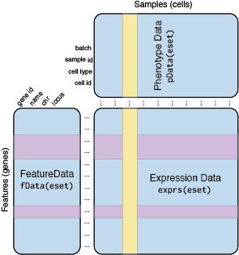

```{r setup, include=FALSE}
knitStart <- Sys.time()
knitr::opts_chunk$set(echo = TRUE)
source('scripts/utils.R')
```

## Dataset description
These data were generated by the Goff and Brown labs as preliminary data for a project to understand the cell type-specific differences in gene expression in the developing and adult motor cortex of a mouse model of familial Amyotrophic Lateral Sclerosis (ALS). Dissected M1 cortices were enzymatically dissociated and used as input for the 10x Genomics 3' Gene Expression Profiling system (V2).


* Whole dissociated postnatal day 6-7 motor cortex
* $n=5$ replicates each of wild type and a human C9orf72 pathogenic repeat BAC transgenic line (C9-500-BAC)
* 10x Genomics 3’ Gene Expression analysis
* ~8000 cells targeted per replicate
* 10 samples sequenced on 1 NovaSeq 6000 S1 Flowcell
* ~1.6B reads
* Standard demuxing and preprocessing with 10x genomics [Cellranger (v2.2) software tool](https://support.10xgenomics.com/single-cell-gene-expression/software/pipelines/latest/what-is-cell-ranger)

### Data availability
Interactive dataset browser:
[http://neurocoglab.gofflab.org](http://neurocoglab.gofflab.org)

Code/scripts to reproduce todays lab:
[https://github.com/gofflab/neurocog_scRNA_seq](https://github.com/gofflab/neurocog_scRNA_seq)

Data link:
[https://drive.google.com/open?id=1sSoBnsXhOrLTC-EsTdSk18h4lEiZHQ8D](https://drive.google.com/open?id=1sSoBnsXhOrLTC-EsTdSk18h4lEiZHQ8D)


## Objectives for Today
* Import/clean preprocessed scRNA-Seq data into Monocle Framework (R/Bioconductor)
* QC analysis of cell and gene quality
* Dimensionality reduction
* Clustering
* Cell type annotation
* Intro to Differential Expression
* Pattern discovery & annotation

## Importing Preprocessed Data
This tutorial assumes that we have already performed the initial preprocessing of the data using the cellRanger pipeline from 10x Genomics. One of the main results of this preprocessing is a $genes X cells$ matrix of Unique Molecular Identifier (UMI) counts. E.g.:

|     |cell1 |cell2 |cell3 |
|-----|-----:|-----:|-----:|
|gene1|  0   |2     |    0|
|gene2|  15  |7     |    3|
|gene3|  1   |0     |    2|
...

So let's import the raw count data from the cellRanger output.  The key files here are `matrix.mtx`, `barcodes.tsv`, and `genes.tsv`.

```{r import_10x, cache=TRUE}
cellranger_dir <- 'data/10x/preprocessed'
raw <- load_cellranger_matrix(cellranger_dir)
#saveRDS(raw,'data/raw.rds')
```

```{r}
raw
```

### Data cleaning and Annotation
We would also like to add a bit of external information about the genes and samples (cells) to help us make some better interpretations downstream. This annotation corresponds to metadata about how and when the samples were processed, as well as some of the important parameterizations for our experimental questions.

```{r feature_cleaning}
# Prep for CDS
fd <- fData(raw)
#change default feature column names to Monocle-friendly terms
colnames(fd) <- c("gene_id","gene_short_name")

# Prep for CDS
pd <- pData(raw)
# Extract sample 'number' information from barcode (cell_id) substring
pd$sample_num<-as.numeric(str_sub(pd$barcode, start= 18))
```

Merge in external annotations
```{r annot_import}
sample_info<-read.csv('data/annotation/sample_aggregation.csv',header=T)
#sample_info<-sample_info[,-2]

master_sample_sheet<-read.csv('data/annotation/sample_info.csv',header=T)

#Merge cellranger aggr data with external annotation
sample_info<-merge(sample_info,master_sample_sheet,by.x="library_id",by.y="sample_id",sort = FALSE)

DT::datatable(sample_info)

#Merge all annotation with pd
pd<-merge(pd,sample_info,by.x='sample_num',by.y=0,sort=F)
rownames(pd)<-pd$barcode

```

### The CellDataSet object
Many R packages for high-throughput sequencing data use a general structure for data organization (Class) derived from the Bioconductor [ExpressionSet](https://www.bioconductor.org/packages/devel/bioc/vignettes/Biobase/inst/doc/ExpressionSetIntroduction.pdf) object. The _Monocle_ package defines the `CellDataSet` class, which inherits from `ExpressionSet`, to hold and manipulate single cell RNA-Seq data. The layout of a CDS object is roughly as follows:



Here we create the Monocle CellDataSet object from our imported, cleaned, and annotated data.  This is the data object that we will be modifying/exploring for the rest of the tutorial.

#### Create monocle CDS object
```{r create_cds}
dat <- newCellDataSet(exprs(raw),
                  phenoData = new("AnnotatedDataFrame", data = pd),
                  featureData = new("AnnotatedDataFrame", data = fd),
                  lowerDetectionLimit = 0.5,
                  expressionFamily = negbinomial.size())

dat
```

### Subsetting cells
For the exclusive purposes of this lab, and to allow for things to run in a reasonable timeframe, we are going to reduce the number of cells we will consider randomly by ~ 90%. (This is not normally done, but we won't get through much in this lab unless we cull).

```{r eval=FALSE,echo=TRUE,cache=TRUE}
#sampleFactor<-0.1
#sampleCellBarcodes<-sample(rownames(pData(dat)),dim(dat)[2]*sampleFactor)
#write.csv(sampleCellBarcodes,'data/annotation/sampleCellBarcodes.csv')
```

```{r subsample}
sampleCellBarcodes<-read.csv('data/annotation/sampleCellBarcodes.csv',stringsAsFactors = FALSE)$x
dat<-dat[,sampleCellBarcodes]

dat
```

## Data QC and Filtering
Before we move on to exploration and annotation of the data, we first need to get some summary statistics such as a scaling factor and an estimate of the dispersion for each gene (variance in excess of what is expected for a given model fit).
```{r}
dat<-estimateSizeFactors(dat)
dat<-estimateDispersions(dat,cores=4)
#saveRDS(dat,'data/dat.rds')
```

### Gene QC metrics

#### Minimum number of cells expressing a given gene  
It's a good idea, and saves time/effort to identify and only consider genes whose expression levels are detected in a certain number or proportion of cells within your assay.


```{r gene_qc_1}
dat<-detectGenes(dat)
cellCutoff<-20
expressed_genes <- row.names(subset(fData(dat),
    num_cells_expressed >= cellCutoff))

hist(fData(dat)$num_cells_expressed,col="red",breaks=50,main="Number of cells expressing a given gene")

hist(log10(fData(dat)$num_cells_expressed),col="red",breaks=50,main="Number of cells expressing a given gene")
abline(v=log10(cellCutoff),lty="dashed")

```

We have now identified a total of `r length(expressed_genes)` that are detectably expressed in at least `r cellCutoff` cells in our dataset.

#### Distribution of gene mean copies per cell
What is the average expression level (in mRNA Copies per cell) for each gene?
```{r gene_qc_2}
fData(dat)$mean_cpc<-Matrix::rowMeans(exprs(dat))
hist(log10(fData(dat[expressed_genes,])$mean_cpc),col="purple",breaks=50,main="Mean RNA copies per cell")
```

### Cell QC metrics

#### Distribution of detected genes across cells
How many genes are expressed in a given cell?
```{r cell_qc_1}
hist(pData(dat)$num_genes_expressed,col="darkgreen",breaks=50,main="Number of genes expressed per cell")

```

#### Mt-genome proportion 
A high proportion of mitochondrial genes may indicate a lower than ideal capture efficiency for a given cell.
```{r cell_qc_mito}
mito_genes<-fData(dat)$gene_id[grepl("^mt-",fData(dat)$gene_short_name)]

pData(dat)$mt_reads <- Matrix::colSums(exprs(dat)[mito_genes,])
pData(dat)$total_reads  <- Matrix::colSums(exprs(dat))
pData(dat)$mito_ratio <- pData(dat)$mt_reads/pData(dat)$total_reads

ggplot(pData(dat),
       aes(x = num_genes_expressed, y = mito_ratio)) + 
       geom_point() +
       labs(x = "Number of genes", y = "Mitochondrial ratio") +
       scale_color_brewer(palette = "Set1") +
       theme(legend.position = "none") + 
       monocle:::monocle_theme_opts()
```

#### Total mRNAs per cell
To get a general picture of the capture efficiency and depth of information for each cell we can look at the total mRNA mass recovered per cell.
```{r}
pData(dat)$Total_mRNA<-Matrix::colSums(exprs(dat))

hist(pData(dat)$Total_mRNA,col="darkblue",breaks=50,main="Total mRNAs sequenced per cell")
```

_*Bonus question:*_ How many mRNAs do we *expect* are in a given eukaryotic cell?

For each of the above QC 'criterion' we can define thresholds that can be used to filter cells/genes to improve the quality of the dataset.  Here is usually where obvious doublet cells (more than one cell is associated with a single barcode sequence) or low-quality cells are removed prior to doing any further statistical interpretations.

## Selection of High-Variance Genes
* Per-gene technical variance in scRNA-Seq data [is well modeled](http://www.nxn.se/valent/2017/11/16/droplet-scrna-seq-is-not-zero-inflated) by a [negative binomial fit](https://en.wikipedia.org/wiki/Negative_binomial_distribution).

* Genes with excess variation (overdispersion) _should_ have high biological variation above and beyond the modeled technical variance.

* We select this subset to highlight differences between cell types and states for downstream analyses.
```{r, cache=TRUE}
disp_table = dispersionTable(dat)
disp_table = disp_table %>% mutate(excess_disp =
  (dispersion_empirical - dispersion_fit) / dispersion_fit) %>%
    arrange(plyr::desc(excess_disp))

expression_cutoff<-1e-04
top_subset_genes = intersect(fData(dat)$gene_id[fData(dat)$mean_cpc>=expression_cutoff],disp_table$gene_id[disp_table$excess_disp>0])
#top_subset_genes = as.character(head(disp_table, 1000)$gene_id)

dat <- setOrderingFilter(dat, top_subset_genes)

plot_ordering_genes(dat)
```

## Monocle Preprocessing
Standard secondary preprocessing for single cell RNA-Seq involves projecting expression data into the top principal components to identify ranked sources of variation. This is usually done after log-transforming the data to stabilize the variance across the dynamic range of gene expression. Monocle conveniently provides a function `preprocessCDS()` that will do this transform and PCA analysis.

```{r}
#log-transform and initial PCA
dat <- preprocessCDS(dat,  method = 'PCA',
                         norm_method = 'log',
                         num_dim = 25, #Arbitrary....I should look at scree plot.
                         verbose = T)

plot_pc_variance_explained(dat,max_components=50)
```

By looking at a scree-plot of the variance explained by each component, you can pick a reasonable threshold number of components to incorporate into the downstream analysis.  Here we have chosen 25 components as slightly past the tangent point for the curve.

## Dimensionality Reduction
A crucial next step is to summarize the set of significant learned principal components into an interpretable set of dimensions (e.g. 2). You may recognize these as t-SNE plots, although a more robust, faster, and appropriate algorithm [Uniform Manifold Approximation and Projection (UMAP)](https://www.nature.com/articles/nbt.4314) is currently being promoted.
```{r}
#UMAP dimensionality reduction
dat <- reduceDimension(dat, max_components = 2,
                       reduction_method = 'UMAP',
                       metric="correlation",
                       #metric="cosine",
                       #min_dist = 0.75,
                       #n_neighbors = 50,
                       verbose = T
                        )
```

## Cell Clustering
Our next task is to find and annotate groups of cells with similar transcriptional profiles. To do this, we will use a fast and robust 'community detection algorithm' called [Louvain clustering](https://arxiv.org/abs/0803.0476). 
```{r, cache=TRUE}
dat <- clusterCells(dat,
                        method = 'louvain',
                        res = 1e-3,
                        #res = NULL,
                        louvain_iter = 1,
                        verbose = T)

```

And now lets see what our learned clusters/communities look like.  Remember, at this point, we haven't looked for or filtered for a single marker gene to identify cell types. This is part of the power of using the aggregate transcriptional profile (well, high-variance genes at least) to identify these clusters in an unbiased manner.

### Visualizations
```{r}
cell_size<-0.5

plot_cell_clusters(dat,color="Cluster", cell_size=cell_size, show_group_id = T) + guides(color=FALSE) + coord_equal(1)
plot_cell_clusters(dat,color="Genotype", cell_size=cell_size) + scale_color_manual(values=c("red","grey40"))

plot_cell_clusters(dat,color="Sex", cell_size=cell_size) + scale_color_manual(values=c("orange","darkblue"))
plot_cell_clusters(dat,color="library_id", cell_size=cell_size)

pdf("figures/initial_clustering.pdf")
plot_cell_clusters(dat,color="Cluster", cell_size=cell_size, show_group_id = T) + guides(color=FALSE) + coord_equal(1)
plot_cell_clusters(dat,color="Genotype", cell_size=cell_size) + scale_color_manual(values=c("red","grey40"))

plot_cell_clusters(dat,color="Sex", cell_size=cell_size) + scale_color_manual(values=c("orange","darkblue"))
plot_cell_clusters(dat,color="library_id", cell_size=cell_size)
dev.off()

```

### Embedding shapes
* Sometimes, clearly defined cell types are obvious puncta in a 2D embedding
* Other times, what you think of as a single cell type may be broken up into several 'subtypes'
* Still more, a single cell 'type' may consist of several 'cell states' that might present as more of an amorphous shape in an embedding
* Cells in an ergodic transitioning state may be represented as a 'pseeudotemporal trajectory' as different cells pass through different phases of the transition.  
    - These trajectories can be _*very*_ useful as a high-resolution timecourse for how cells respond to changes or cues.
* What types of shape:stories might be represented in these clusters? What cell types do we expect to find in a P6-7 mouse motor cortex?

### Annotating cells by marker gene expression
Some (not all) of the markers came from here 
[http://casestudies.brain-map.org/celltax](http://casestudies.brain-map.org/celltax)


First, we will make a few plots with known marker(anchor) genes to place some of the learned clusters into their biological contexts.
```{r landmarks}
pdf("figures/Markers.pdf",width=15,height=15)
#Interneuron markers
plot_cell_clusters(dat, markers=c("Gad1","Vip","Chat","Sst","Lhx6","Pvalb","Htr3a"), cell_size=cell_size) + ggtitle("Interneurons")  + coord_equal(1)

plot_cell_clusters(dat, markers=c("Gad2","Pvalb","Sst","Vip","Ndnf","Cck"), cell_size=cell_size) + ggtitle("Interneurons-Level 1 Markers")  + coord_equal(1)

# Excitatory markers
plot_cell_clusters(dat, markers=c("Slc17a6","Slc17a7","Rorb","Ctgf"), cell_size=cell_size) + ggtitle("Pyramidals")  + coord_equal(1)

plot_cell_clusters(dat, markers=c("Pantr1","Cux2","Satb2"), cell_size=cell_size) + ggtitle("Upper layers")  + coord_equal(1)

plot_cell_clusters(dat, markers=c("Cdh13","Ctgf","Tle4","Bcl11b"), cell_size=cell_size) + ggtitle("Deep layers")  + coord_equal(1)

plot_cell_clusters(dat, markers=c("Cux2","Nr5a1","Scnn1a","Tg3","Rorb","Tg2","Rbp4","Ntsr1","Ctgf","Cdh13","Chrna6"), cell_size=cell_size) + ggtitle("Excitatory - Rough Laminar Markers")  + coord_equal(1)

plot_cell_clusters(dat, markers=c("Sla","S100a3","Macc1","Olfr78","Wfdc18","Wfdc17","Aldh1a7","Oprk1","Rgs8","Htr2c","Hpgd","Sdc1","Trh","Cpa6","Ppp1r18","Fam150a","F2r","P2ry12","Mup3"), cell_size=cell_size) + ggtitle("Excitatory - ALM Excitatory markers Economo et al")  + coord_equal(1)

# Brain Fibroblasts
plot_cell_clusters(dat, markers=c("Lum","Col1a1","Lama1","Efemp1","Dcn","Col6a1"), cell_size=cell_size) + ggtitle("Brain Fibroblasts") + coord_equal(1)

# Vascular endothelium
plot_cell_clusters(dat, markers=c("Vwf","Kit","Flt1"), cell_size=cell_size) + ggtitle("Vascular Endothelium") + coord_equal(1)

# Vascular Smooth muscle
plot_cell_clusters(dat, markers=c("Bgn"), cell_size=cell_size) + ggtitle("Vascular Smooth Muscle")  + coord_equal(1)

# Astrocytes
plot_cell_clusters(dat, markers=c("Gfap","Slc1a3","Aqp4"), cell_size=cell_size) + ggtitle("Astrocytes") + coord_equal(1)

# Neural progenitors
plot_cell_clusters(dat, markers=c("Fabp7","Pax6","Sox2","Hes5","Nes","Eomes","Id2","Msi1","Sox1","Igfbpl1","Riiad1","Top2a","Ascl1"), cell_size=cell_size) + ggtitle("Neural Progenitors") + coord_equal(1)

# Oligodendrocytes
plot_cell_clusters(dat, markers=c("Mbp","Mobp","Pdgfra","Bmp4","Tmem2"), cell_size=cell_size) + ggtitle("Oligodendrocytes")  + coord_equal(1)

# Microglia
plot_cell_clusters(dat, markers=c("Ctss"), cell_size=cell_size) + ggtitle("Microglia")  + coord_equal(1)

# Erythrocytes
plot_cell_clusters(dat, markers=c("Hbb-bt","Hbb-bs","Hba-x","Hba-a1"), cell_size=cell_size) + ggtitle("Erythrocytes")

dev.off()


plot_cell_clusters(dat, markers=c("Slc17a6","Slc17a7","Rorb","Ctgf"), cell_size=1) + ggtitle("Pyramidals")  + coord_equal(1)

```
The expression of these _known_ marker genes across clusters can be used to infer celltype:cluster associations.

### Cluster-specific marker genes
Similar to differential expression, we can identify novel marker genes for individual clusters. We can do this using [Moran's I test](http://cole-trapnell-lab.github.io/monocle-release/monocle3/#identifying-genes-that-vary-in-expression-over-a-trajectory) for spatial autocorrelation in the 2D UMAP embedding. First we must learn the relationship between cells in the UMAP embedding.  We do this by first learning a `principal graph` structure and identify genes with significant spatial autocorrelation along the graph using `principalGraphTest()`. We will use the results of the Moran's I test as a 'relatedness' filter for putative marker genes for each cluster.

```{r cluster_markers_1_principalGraph, cache=TRUE}
#Takes ~45 min to run...
start <- Sys.time()
spatial_res <- principalGraphTest(dat[expressed_genes,], relative_expr = TRUE, k = 10, cores = 6,verbose=TRUE)
end <- Sys.time()
end - start
```

Then we can calculate the specificity score for each gene as well.
$S_{g,i}=1-\sqrt{H(\frac{\sum_{1}^{n} p_g q_i}{n}) - \sum_{1}^{n} \frac{H(p_g q_i)}{n}}$

```{r cluster_markers_2, cache=TRUE}
system.time(cluster_marker_res <-
  find_cluster_markers(dat[expressed_genes,],
                       spatial_res,
                       group_by = 'Cluster',
                       morans_I_threshold = 0.25,
                       verbose=TRUE))
```

Now we can take a look a the the genes that are most specific for each of the annotated clusters.  This will help us with identifying cell types.
```{r cluster_markers_3}
genes <-
  (cluster_marker_res %>%
  dplyr::filter(mean > 0.5, percentage > 0.1) %>%
  dplyr::group_by(Group) %>%
  dplyr::top_n(1, wt = specificity))

options(repr.plot.width=22, repr.plot.height=12)
plot_markers_by_group(dat[expressed_genes,], genes$gene_short_name, group_by = 'Cluster', ordering_type = 'maximal_on_diag')

pdf("figures/cluster_markers.pdf",width=7,height=6)
plot_markers_by_group(dat[expressed_genes,], genes$gene_short_name, group_by = 'Cluster', ordering_type = 'maximal_on_diag')
dev.off()
```

Here are the top 10 specific genes for each learned cluster
```{r}
nGenesPerGroup<-10
top_n_genes <-
  (cluster_marker_res %>%
  dplyr::filter(mean > 0.5, percentage > 0.1) %>%
  dplyr::group_by(Group) %>%
  dplyr::top_n(nGenesPerGroup, wt = specificity))

DT::datatable(top_n_genes)
```
These genes suggest, for example, that group (8) may contain predominantly oligodendrocytes (Pdgfra, Olig2, Sox10, Olig1, etc).

```{r}
groupOfInterest<-8
marker_genes <- top_n_genes$gene_short_name[top_n_genes$Group==groupOfInterest][1:4]
plot_cell_clusters(dat,
                   markers = as.character(marker_genes),
                   show_group_id = T, cell_size = 1)
```

## Major cell type annotation
Using insights from known and novel marker genes, we can annotate individual clusters as containing major cell types as follows:

```{r}
#These will have to be manually assigned after each new clustering solution
plot_cell_clusters(dat,color="Cluster", cell_size=cell_size, show_group_id = T) + guides(color=FALSE) + coord_equal(1)

pData(dat)$CellType<-"Unknown"
pData(dat)$CellType[pData(dat)$Cluster %in% c(8,16)] <- "Oligodendrocyte"
pData(dat)$CellType[pData(dat)$Cluster %in% c(7)] <- "Astrocyte/Radial Glia"
pData(dat)$CellType[pData(dat)$Cluster %in% c(5,10,14,18)] <- "Interneurons"
pData(dat)$CellType[pData(dat)$Cluster %in% c(1,2,3,4,6)] <- "Excitatory Neurons"
pData(dat)$CellType[pData(dat)$Cluster %in% c(13)] <- "Microglia"
pData(dat)$CellType[pData(dat)$Cluster %in% c(11)] <- "Vascular Endothelium"
pData(dat)$CellType[pData(dat)$Cluster %in% c(17)] <- "Vascular Smooth Muscle"
pData(dat)$CellType[pData(dat)$Cluster %in% c()] <- "Cycling Neural Progenitor"
pData(dat)$CellType[pData(dat)$Cluster %in% c(12)] <- "Brain Fibroblasts"
pData(dat)$CellType[pData(dat)$Cluster %in% c()] <- "Doublets"
pData(dat)$CellType[pData(dat)$Cluster %in% c(15)] <- "RBCs"

colorCount <- length(unique(pData(dat)$CellType))
getPalette <- colorRampPalette(brewer.pal(9, "Set1"))

p<-plot_cell_clusters(dat,color="CellType",cell_size=0.8, show_group_id = TRUE) + scale_color_manual(values=getPalette(colorCount)) + coord_equal(1)

p

#Save to .pdf
pdf("figures/Major_celltype.pdf",width=12,height=8)
p
dev.off()
```

## Recursive analysis and annotation of sub-celltypes
* Different major cell types have different degrees of heterogeneity
  - interneuron subtypes appear quite distinct
  - several 'types' of pyramidals blend together
  - Neural progenitors and Oligos (at P6) appear to be drawn out in a linear fashion
* Current best practices include recursive analysis of major cell types
  - 'high-variance' genes will change if you refine your scope to only focus on one 'major cell type'
  - can resolve sub-celltypes or otherwise hidden cell states.

## Differential Testing
Often, we design our experiments to explicitly ask refined and focused questions about differential gene expression. Monocle includes a powerful gene expression testing framework to help you find genes that are differentially expressed between groups of cells and assesses their statistical signficance. Grouping information (or other continuous parameters for your modeling) are stored in the phenoData (pData) table of each CellDataSet. Any column in pData can be added to the linear model(s).  Monocle will test the signficance of each gene's expression level across the different groups of cells defined by the comparison of two models. [Monocle uses the likelihood ratio test](http://cole-trapnell-lab.github.io/pdfs/papers/trapnell-cacchiarelli-monocle.pdf) to compare two linear models (full vs reduced) for a given gene to determine whether the parameters lost in the reduced model explain a significant amount of variance in the data. 

```{r cache=TRUE}
#Takes ~6-8 minutes to run...
system.time(CellType_DE_genes<-differentialGeneTest(dat[expressed_genes],fullModelFormulaStr = "~num_genes_expressed+CellType",reducedModelFormulaStr = "~num_genes_expressed",cores=6,verbose=TRUE))

sigCutoff<-1.0e-9
CellType_sigGeneIDs<-rownames(CellType_DE_genes[CellType_DE_genes$qval<=sigCutoff,])
CellType_sigGenes<-CellType_DE_genes[CellType_DE_genes$qval<=sigCutoff,"gene_short_name"]

length(CellType_sigGenes)

#pdf("figures/CellType_sigGenes_jitter_by_cluster.pdf",width=10,height=5)
#gene_logfc_easy_jitter(dat,CellType_sigGenes, celltypes = unique(pData(dat)$CellType))
#dev.off()

```

Below is a table of all significantly differentially expressed genes ($p \lteq $ `rsigCutoff`) between major CellTypes.
```{r}
sigTable<-CellType_DE_genes[order(CellType_DE_genes$qval,decreasing=FALSE),]
DT::datatable(sigTable[sigTable$qval <= sigCutoff,])
```

## Pattern Discovery (NMF)
Finally, we can step beyond marker gene analysis, and use some ['latent space'](https://www.biorxiv.org/content/10.1101/395004v2) discovery methods to learn patterns of co-regulated gene expression. 

These patterns can be used to identify/define:
  * Cell type identities
  * Biological processes
  * Spatial gradients
  * Other cellular features

... often with significantly greater resolution and precision than marker genes.

Importantly, these patterns are 'data driven' and often yield insights into the heterogeneity and complexity of a given dataset that were unanticipated.

```{r NNMF, cache=TRUE}
nPatterns<-30
# Takes about ~3-4 minutes...
system.time(dat.nnmf<-nnmf(as.matrix(log10(exprs(dat)[expressed_genes,]+1)), k = nPatterns, alpha = rep(0,3), beta = rep(0,3), method = c("scd"), loss = c("mse"),
    init = NULL, mask = NULL, W.norm = -1L, check.k = TRUE, max.iter = 500L, rel.tol = 1e-4,
    n.threads = 6, trace = 10, verbose = TRUE, show.warning = TRUE))

# Gene x Pattern matrix
dim(dat.nnmf$W)

# Pattern x Cell matrix
dim(dat.nnmf$H)

#Add patterns to phenotype data for visualization
patterns.df<-data.frame(t(dat.nnmf$H))
colnames(patterns.df)<-paste0("Pattern_",c(1:nPatterns))

pData(dat)<-cbind(pData(dat),patterns.df)

pdf("figures/patterns.pdf",width=10,height=10)
lapply(c(1:nPatterns),function(i){
plot_cell_clusters(dat, color=paste0("Pattern_",i), cell_size=cell_size) + 
    ggtitle(paste0("Pattern_",i))  + 
    scale_colour_viridis() +
    coord_equal(1)
})
dev.off()

i<-21
plot_cell_clusters(dat, color=paste0("Pattern_",i), cell_size=cell_size) + 
    ggtitle(paste0("Pattern_",i))  + 
    scale_colour_viridis() +
    coord_equal(1)

```

### Genes associated with learned patterns
```{r}
geneWeights.df<-data.frame(dat.nnmf$W)
colnames(geneWeights.df)<-paste0("Pattern_",c(1:nPatterns))

  #fData(dat)[head(rownames(dat.nnmf$W)[order(dat.nnmf$W[,patternOfInterest],decreasing=TRUE)]),]
tmp<-merge(fData(dat)[,c("gene_id","gene_short_name")],geneWeights.df,by=0)

DT::datatable(tmp[,-1])
```

Lets see how these patterns learned directly from the data correlate with annotated features
```{r}
featuresOfInterest<-c("library_id","Genotype","Sex","num_genes_expressed","CellType")
phenoMat<-pData(dat)[,featuresOfInterest]
phenoMat$library_id<-as.numeric(phenoMat$library_id)
phenoMat$Genotype<-as.numeric(factor(phenoMat$Genotype))
phenoMat$Sex<-as.numeric(factor(phenoMat$Sex))
phenoMat$CellType<-as.numeric(factor(phenoMat$CellType))

for (a in levels(pData(dat)$library_id)){
	phenoMat[[paste("library_",a,sep="")]]<-as.numeric(factor(pData(dat)$library_id)==a)
}

for (a in levels(pData(dat)$Genotype)){
	phenoMat[[a]]<-as.numeric(pData(dat)$Genotype==a)
}

for (a in levels(pData(dat)$Sex)){
	phenoMat[[a]]<-as.numeric(pData(dat)$Sex==a)
}

for (a in levels(factor(pData(dat)$CellType))){
	phenoMat[[a]]<-as.numeric(pData(dat)$CellType==a)
}

patternPhenoCor<-cor(phenoMat,patterns.df,method="spearman")
#phenoCorTest<-cor.test(phenoMat,dat.pca$x)
patternPhenoCor.melt<-melt(patternPhenoCor)

patternPhenoCor.melt$class<-"Other"
patternPhenoCor.melt$class[patternPhenoCor.melt$Var1 %in% paste("library_",levels(factor(pData(dat)$library_id)),sep="")]<-"library"
patternPhenoCor.melt$class[patternPhenoCor.melt$Var1 %in% levels(factor(pData(dat)$CellType))]<-"Cell Type"
patternPhenoCor.melt$class[patternPhenoCor.melt$Var1 %in% levels(factor(pData(dat)$Genotype))]<-"Genotype"
patternPhenoCor.melt$class[patternPhenoCor.melt$Var1 %in% levels(factor(pData(dat)$Sex))]<-"Sex"

#col.order<-order.dendrogram(as.dendrogram(hclust(dist(t(patternPhenoCor)))))
col.order<-order.dendrogram(as.dendrogram(hclust(dist(t(patternPhenoCor[rownames(patternPhenoCor) %in% levels(factor(pData(dat)$CellType)),])))))
row.order<-order.dendrogram(as.dendrogram(hclust(dist(patternPhenoCor))))


patternPhenoCor.melt$Var2<-factor(patternPhenoCor.melt$Var2,levels=colnames(patternPhenoCor)[col.order])
patternPhenoCor.melt$Var1<-factor(patternPhenoCor.melt$Var1,levels=rownames(patternPhenoCor)[row.order])

p<-ggplot(patternPhenoCor.melt)
p<- p + geom_tile(aes(x=Var2,y=Var1,fill=value)) +
	scale_fill_gradient2(low="steelblue",mid="white",high="tomato")  +
  theme(axis.text.x=element_text(angle=-90)) +
  ggtitle("Pattern:Phenotype Correlation") + xlab("Pattern") + ylab("Feature") +
	coord_equal()
p
#pdf(paste0("projections/cut",cut,"/Projected_pattern_pheno_correlations.pdf"),width=30,height=15)
#p + theme(axis.text.x=element_text(angle=-45, hjust=0))
#dev.off()
```

## Exploratory Analysis
Never underestimate the power of exploratory data analysis.  Here's a snapshot of the full dataset in a [low-latency scRNA-Seq exploration tool](https://github.com/chanzuckerberg/cellxgene) being developed by the Chan Zuckerberg Initiative in conjunction with the [Human Cell Atlas project](https://www.humancellatlas.org/).

Interactive dataset browser:
[http://neurocoglab.gofflab.org](http://neurocoglab.gofflab.org)

## Session Information
```{r}
sessionInfo()

```

## Knit Time
With caches
```{r}
knitEnd <- Sys.time()
knitEnd - knitStart
```

